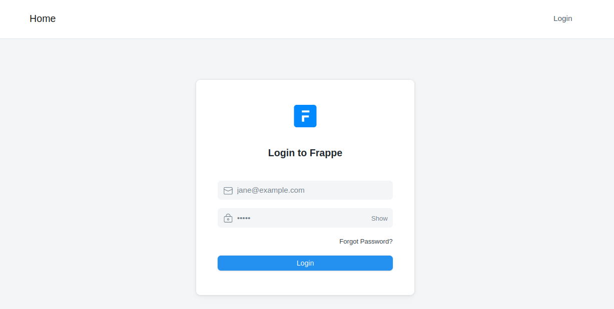
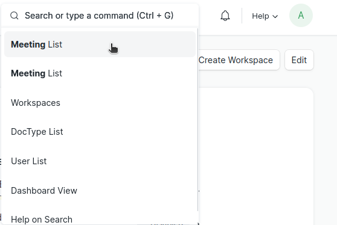
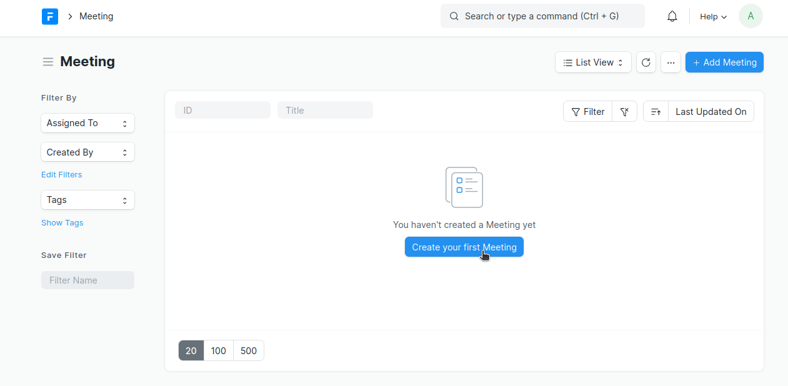
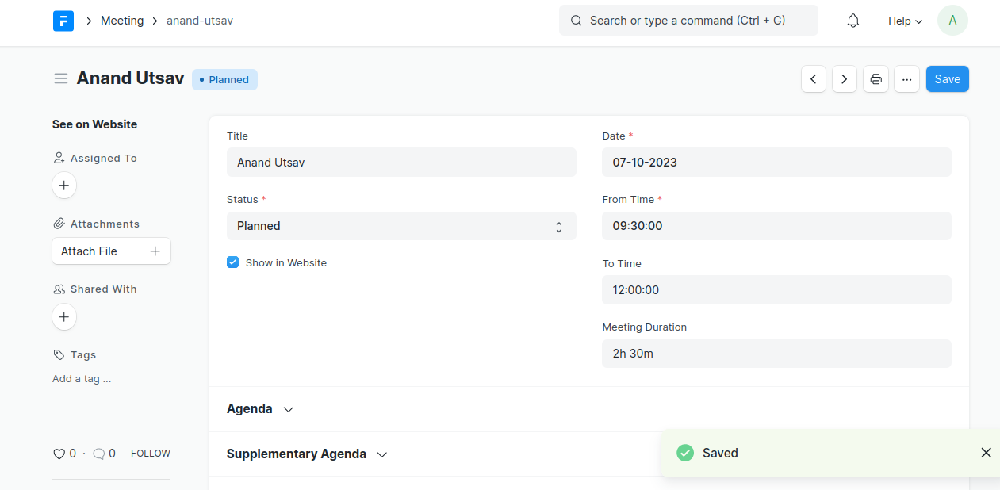
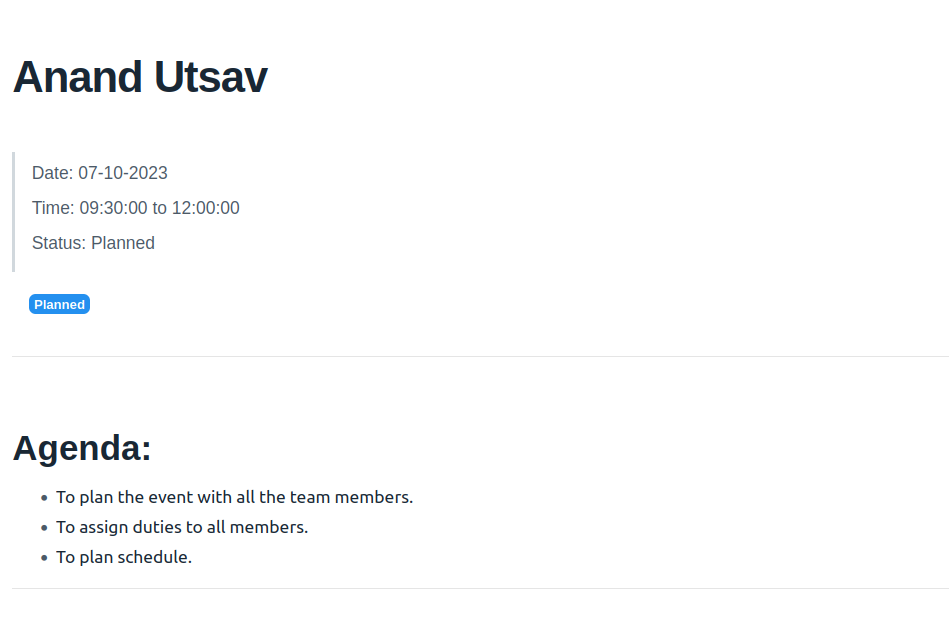
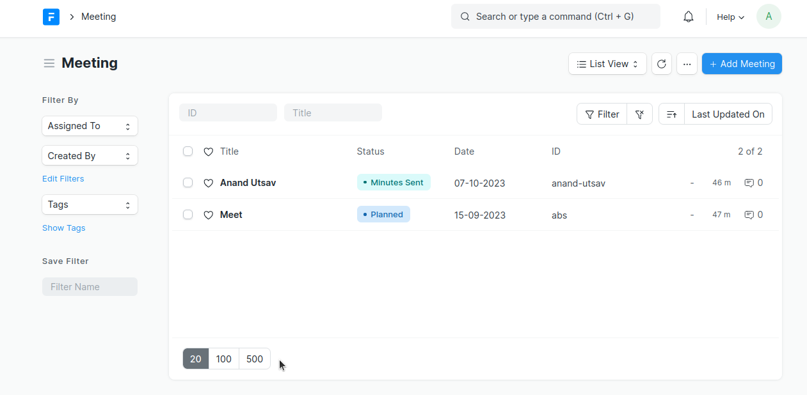

# Meeting App

>"Power Up Your Meetings with Frappe's Meeting App!"

Are your meetings feeling mundane and unproductive? Say hello to a game-changer in the world of meeting management! This document provides an in-depth guide on how to use the Meeting app created with Frappe Framework. From seamless invitations to effortless minute-taking, this app will revolutionize the way you meet. Get ready to elevate your meetings to a whole new level!

## Installation

- Set up frappe-bench using [Install frappe](https://github.com/D-codE-Hub/Frappe-ERPNext-Version-14--in-Ubuntu-22.04-LTS)
- Create a site for installing Meeting app:
  ```bash
  $ cd frappe-bench
  $ bench new-site meeting.com
  # Set administrator password and it will be the password for your site with username "administrator"
  $ bench get-app https://github.com/Diya050/meeting.git
  $ bench --site meeting.com install-app meeting
  ```
- Now open site and use app:
  ```bash
  $ bench use meeting.com
  $ bench start
  ```
- Your app is running at 127.0.0.1:8000
- Go to http://127.0.0.1:8000/app/meeting for creating new meetings.

## Getting Started

This section will guide you through the initial setup and help you get started with creating and managing meetings.

- Log in to your Frappe instance as a user with the necessary permissions.
 


  
- If you are the Meeting Manager then you have to create users with role Meeting Attendee whom you wish to invite for a meeting in future.
  
- You also have to manage the permissions that you want to give to each user.

- From the Frappe Desk, from awesome bar navigate to "Meeting List > New Meeting" to create a new meeting.



- Click `Create your first Meeting` to create a meeting:



- This will open a dashboard. Fill the Meeting Title, choose meeting status as planned initially, click see on website (so that it is viewed to all), set date and time (Duration will be calculated automatically), set Agenda and add Invitation Message. Save all these changes.



- This how meeting details would look like on website:

  

- Here is how your past meetings can be accessed in the form of list with their statuses in different colours.

  

- Now since you have planned the meeting, its time to add attendees and send them invitations for the meeting.
  
